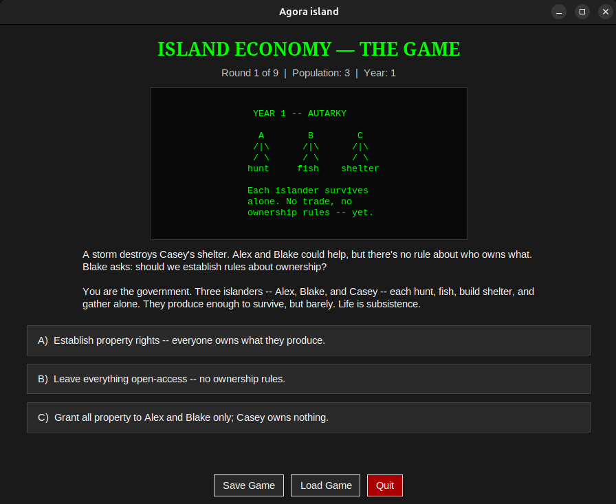

# Agora

**Agora** was the public marketplace and meeting place in ancient Greek cities, where people gathered to trade, discuss, and conduct business.

**Agora** is a business game that introduces the basics of economics through interactive decision-making and simulation.

**Economics**  is a social science that studies the production, distribution, and consumption of goods and services.

**Social science**  is one of the branches of science, devoted to the study of societies and the relationships among members within those societies.

---

## 🏝️ Island Economy — The Game


A playable economic decision tree. You govern a growing island — starting with three castaways producing everything alone, ending (if you're disciplined) as a thriving trade republic. Every choice teaches one real economic concept, backed by an actual country's history.

- **9 rounds**, each built around a real economic concept
- **18 possible endings**, each mapped to a real country's economic history
- **Retro ASCII-art interface** — dark theme, green-on-black, built with Python's `tkinter`
- **Pop-up explanations** after every choice, plus a full ending report card

### Requirements

- Python 3.9+
- `tkinter` (ships with most Python installs — on Debian/Ubuntu: `sudo apt install python3-tk`)
- No other dependencies. No internet connection needed.


### Economic concepts you'll pick up along the way

Autarky · Property rights · Division of labor & comparative advantage · Labor force growth · Extent of the market · Medium of exchange & commodity money · Financial intermediaries & warehouse banking · Representative money & the gold standard · Capital investment, interest & time preference · Entrepreneurship & productivity growth · Law of demand · Fractional-reserve banking & credit expansion · Inflation & the quantity theory of money · External trade & exchange rates · Tragedy of the commons


### Project layout

```
island_game/
├── main.py              # entry point
├── game_state.py         # decision-tree state machine
├── data/
│   ├── game_data.json    # all rounds, endings, terms, sketches
│   └── parser.py         # loads & validates game_data.json
├── ui/
│   ├── main_window.py    # layout, round display, save/load
│   ├── modals.py          # term & ending pop-ups
│   ├── sketches.py        # ASCII art rendering
│   └── widgets.py         # choice buttons
├── utils/
│   ├── colors.py          # dark theme palette
│   └── fonts.py
└── saves/                 # your save file lands here
```

### Play it

```bash
cd island_game
python3 main.py
```
